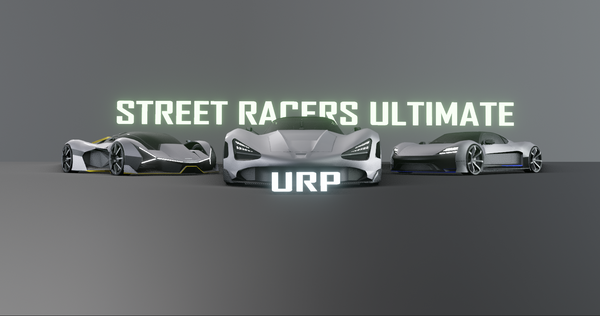

# WHO ARE WE

At XtreemArts, we specialize in creating high-quality 3D assets tailored to meet the diverse needs of game developers and digital creators. Our expertise spans a wide range of industries and genres, ensuring that you can find the perfect asset for your next project.

### Who We Are

We are a team of passionate creators with extensive experience in:
- **3D Asset Creation**: Delivering game-ready models optimized for performance and aesthetics.
- **Blender 3D Artistry**: Crafting visually stunning models with intricate details.
- **Script Programming**: Developing tools and scripts to streamline workflows and enhance functionality.

Our portfolio includes assets ranging from:
- Vehicles like cars and aircraft
- Buildings and architectural props
- Sci-fi elements and futuristic props
- Miscellaneous game-ready items for varied applications

### Why Choose Us?
- **Quality Assurance**: Every asset undergoes rigorous optimization and testing.
- **Diverse Range**: A collection that caters to multiple genres and styles.
- **Tailored Solutions**: Customization options to fit your unique needs.

---

### Featured Image

_Latest release 2026._

[Explore Our Portfolio](portfolio.md) | [Contact Us](contact.md)
